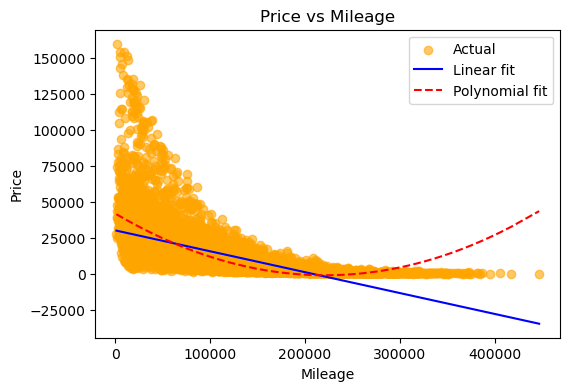
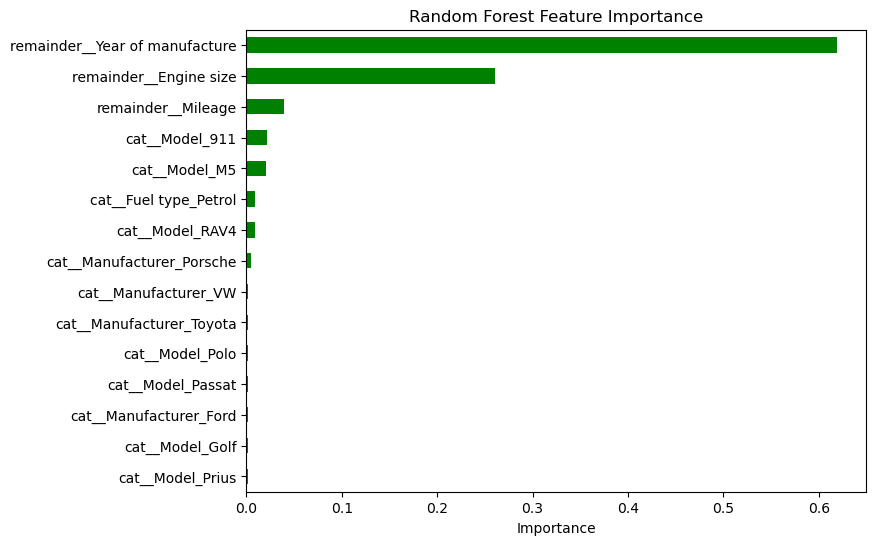
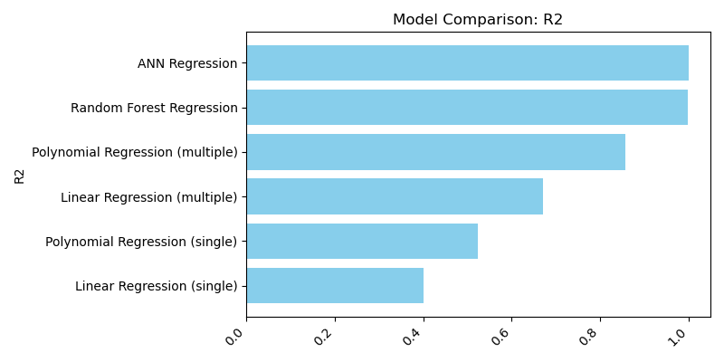
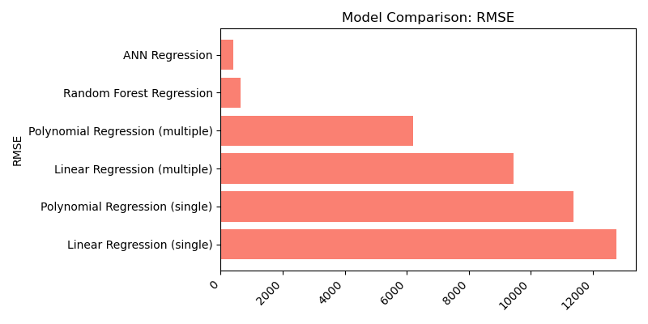

# 🚗 Car Price Prediction & Market Segmentation using Machine Learning

**Understanding AI — MSc AI & Data Science | University of Hull**

A comprehensive machine learning project analysing 50,000+ used vehicle records to predict car prices using regression, ensemble learning, deep learning, and clustering techniques.

---

## 📊 Project Highlights

| Area                      | Technique                       | Key Result                           |
| ------------------------- | ------------------------------- | ------------------------------------ |
| Single Feature Regression | Linear + Polynomial Regression  | Best R²: 0.615                       |
| Multi-Feature Regression  | Polynomial Regression           | R²: 0.862                            |
| Ensemble Learning         | Random Forest Regressor         | R²: 0.998                            |
| Deep Learning             | Artificial Neural Network (ANN) | R²: 0.999                            |
| Clustering                | K-Means + Agglomerative         | Optimal K=2 identified               |
| Feature Importance        | Random Forest Analysis          | Year of Manufacture most influential |

---

## 🚘 Vehicle Price Prediction Analysis

**Dataset:** ~50,000 used vehicle records across multiple manufacturers and models

### Features Used

* Manufacturer
* Model
* Fuel Type
* Engine Size
* Mileage
* Year of Manufacture
* Vehicle Price

---

### Single Feature Regression

Evaluated the predictive power of individual variables:

* Engine Size
* Mileage
* Year of Manufacture

#### Key Findings

* Year of Manufacture was the strongest individual predictor
* Polynomial Regression consistently outperformed Linear Regression
* Engine Size alone showed limited explanatory power





---

### Multi-Feature Regression

Combined:

* Engine Size
* Mileage
* Year of Manufacture

#### Results

| Model                 | R²    | RMSE  |
| --------------------- | ----- | ----- |
| Linear Regression     | 0.681 | 9,286 |
| Polynomial Regression | 0.862 | 6,102 |

The Polynomial Regression model significantly improved predictive performance by capturing non-linear relationships between vehicle characteristics and pricing.

.png)

---

## 🌲 Random Forest Regression

To capture complex interactions between numerical and categorical features, a Random Forest Regressor was implemented.

### Performance

* R² Score: **0.998**
* RMSE: **644**

### Key Insights

* Near-perfect prediction performance
* Strong handling of non-linear relationships
* High interpretability through feature importance analysis

#### Top Price Drivers

1. Year of Manufacture
2. Engine Size
3. Mileage




---

## 🧠 Artificial Neural Network (ANN)

A fully connected neural network was developed using:

* Dense Layers
* ReLU Activation
* Dropout Regularisation
* Adam Optimiser

### Architecture

* Input Layer
* Hidden Layer (128 Neurons)
* Hidden Layer (64 Neurons)
* Dropout (30%)
* Output Layer

### Performance

| Metric   | Value |
| -------- | ----- |
| R² Score | 0.999 |
| RMSE     | 411   |

The ANN achieved the highest overall predictive performance among all evaluated models.

---

## 📈 Model Comparison

The progression from simple regression models to advanced machine learning approaches demonstrates the value of incorporating additional features and non-linear learning methods.

| Model                            | R² Score |
| -------------------------------- | -------- |
| Linear Regression (Single)       | 0.40     |
| Polynomial Regression (Single)   | 0.52     |
| Linear Regression (Multiple)     | 0.67     |
| Polynomial Regression (Multiple) | 0.86     |
| Random Forest                    | 0.998    |
| ANN                              | 0.999    |

### Visual Comparison





---

## 🔍 Market Segmentation using Clustering

Unsupervised learning techniques were applied to identify hidden patterns within the used vehicle market.

### Clustering Techniques

* K-Means Clustering
* Agglomerative Clustering
* Silhouette Analysis

### Findings

* Optimal cluster count identified using Silhouette Score
* Engine Size and Price produced the clearest separation
* Distinct vehicle segments emerged based on value and performance characteristics

### Engine Size vs Price Segmentation


### Mileage vs Price Segmentation


---

## 🛠️ Tech Stack

`Python` `Pandas` `NumPy` `Scikit-Learn` `TensorFlow` `Keras` `Matplotlib` `Seaborn` `Jupyter Notebook`

---

## 📂 Repository Structure

```text
├── car-price-prediction-ml.ipynb
├── car-price-prediction-ml.pdf
├── README.md
│
└── Visuals/
    ├── Actual vs Predicted Price (Multiple Features).png
    ├── Engine size.png
    ├── Mileage.png
    ├── Year of manufacture.png
    ├── Random.png
    ├── Random_Forest_Feature_Importance.png
    ├── Model_Comparison_R2.png
    ├── Model_Comparison_RMSE.png
    ├── k-Means Clusters ['Engine size', 'Price'].png
    └── k-Means Clusters ['Mileage', 'Price'].png
```

---

## 🚀 How to Run

```bash
git clone https://github.com/Harshaa329/car-price-prediction.git

cd car-price-prediction

pip install -r requirements.txt

jupyter notebook car-price-prediction-ml.ipynb
```

---

## 🙋‍♀️ Author

**Harshaa Hariharan** — ML Engineer & Data Scientist

LinkedIn: https://www.linkedin.com/in/harshaa-harshini

GitHub: https://github.com/Harshaa329

Portfolio: Coming Soon
