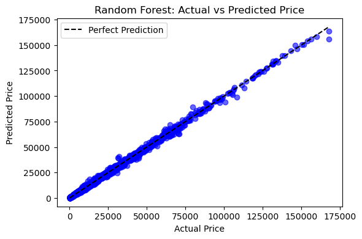

# 🚗 Car Price Prediction & Market Segmentation using Machine Learning

## Overview

This project presents an end-to-end machine learning solution for predicting used car prices and identifying market segments using both supervised and unsupervised learning techniques.

A comprehensive comparison was conducted across multiple regression algorithms, ensemble methods, and deep learning models to determine the most effective approach for vehicle price estimation. Additionally, clustering techniques were applied to uncover hidden patterns within the automotive market.

The project demonstrates the complete machine learning lifecycle, including data preprocessing, feature engineering, model development, evaluation, visualization, and business insight generation.

---

## Business Objective

Accurate vehicle valuation is critical for:

* Automotive dealerships
* Vehicle marketplaces
* Insurance providers
* Fleet management companies
* Automotive finance institutions

The objective was to build a scalable machine learning solution capable of estimating vehicle prices while providing actionable insights into market segmentation and pricing behavior.

---

## Dataset

The dataset contains approximately **50,000 used vehicle records** with both numerical and categorical attributes.

### Features

| Feature             | Description             |
| ------------------- | ----------------------- |
| Manufacturer        | Vehicle manufacturer    |
| Model               | Vehicle model           |
| Engine Size         | Engine capacity         |
| Fuel Type           | Petrol, Diesel, Hybrid  |
| Year of Manufacture | Vehicle production year |
| Mileage             | Distance travelled      |
| Price               | Vehicle sale price      |

---

## Project Workflow

### 1. Data Preprocessing

* Data quality assessment
* Duplicate removal
* Feature validation checks
* Categorical encoding
* Feature scaling
* Train-test split

### 2. Exploratory Data Analysis

* Price distribution analysis
* Feature relationship analysis
* Correlation exploration
* Market trend visualization

### 3. Supervised Learning

Implemented and evaluated:

* Linear Regression
* Polynomial Regression
* Random Forest Regressor
* Artificial Neural Network (ANN)

### 4. Unsupervised Learning

Implemented:

* K-Means Clustering
* Agglomerative Clustering
* Silhouette Analysis

---

# Machine Learning Models

## Single Feature Regression

Evaluated the predictive power of:

* Engine Size
* Mileage
* Year of Manufacture

Methods:

* Linear Regression
* Polynomial Regression

### Key Finding

Year of Manufacture emerged as the strongest individual predictor of vehicle price.

---

## Multi-Feature Regression

Combined:

* Engine Size
* Mileage
* Year of Manufacture

Methods:

* Multiple Linear Regression
* Polynomial Regression

### Result

Polynomial Regression significantly improved prediction accuracy compared to individual feature models.

---

## Random Forest Regression

Implemented a Random Forest Regressor using both numerical and categorical features.

### Advantages

* Captures non-linear relationships
* Handles feature interactions automatically
* Provides feature importance analysis
* Strong predictive performance

### Key Insight

Vehicle age, engine size, and mileage were identified as the most influential pricing factors.

---

## Artificial Neural Network (ANN)

A deep learning regression model was developed using:

* Dense Layers
* ReLU Activation
* Dropout Regularization
* Adam Optimizer

### Benefits

* Learns complex feature relationships
* Strong generalization capability
* High prediction accuracy

---

# Model Performance

| Model                                     | R² Score |
| ----------------------------------------- | -------- |
| Linear Regression (Single Feature)        | 0.40     |
| Polynomial Regression (Single Feature)    | 0.52     |
| Linear Regression (Multiple Features)     | 0.67     |
| Polynomial Regression (Multiple Features) | 0.86     |
| Random Forest Regression                  | 0.998    |
| ANN Regression                            | 0.999    |

### Best Performing Model

🏆 **Artificial Neural Network (ANN)**

* Highest predictive accuracy
* Lowest prediction error
* Best overall performance

---

# Clustering & Market Segmentation

To complement predictive modelling, clustering techniques were applied to identify natural groupings within the used car market.

## Techniques Used

### K-Means Clustering

Used to identify vehicle groups based on:

* Engine Size
* Mileage
* Price

### Agglomerative Clustering

Applied to compare cluster quality and hierarchical grouping behavior.

### Silhouette Analysis

Used to determine the optimal number of clusters.

---

## Business Insights

The clustering analysis revealed distinct vehicle segments that can support:

* Inventory planning
* Dynamic pricing strategies
* Customer segmentation
* Market positioning
* Vehicle recommendation systems

---

# Visualizations

## Regression Analysis

### Actual vs Predicted Price (Multiple Features)

.png)

### Engine Size vs Price


### Mileage vs Price


### Year of Manufacture vs Price


---

## Random Forest Analysis

### Random Forest Predictions



### Feature Importance


---

## Model Comparison

### R² Comparison


### RMSE Comparison


---

## Clustering Analysis

### Engine Size vs Price Clusters


### Mileage vs Price Clusters


---

# Technology Stack

### Programming Language

* Python

### Data Processing

* Pandas
* NumPy

### Machine Learning

* Scikit-Learn

### Deep Learning

* TensorFlow
* Keras

### Data Visualization

* Matplotlib
* Seaborn

### Development Environment

* Jupyter Notebook

---

# Key Achievements

✅ Built a complete end-to-end machine learning pipeline

✅ Evaluated multiple regression approaches

✅ Achieved R² > 0.99 using ANN and Random Forest models

✅ Applied clustering techniques for market segmentation

✅ Generated actionable insights from automotive sales data

✅ Demonstrated both supervised and unsupervised learning methodologies

---

# Repository Structure

```text
Car-Price-Prediction/
│
├── car-price-prediction-ml.ipynb
├── car-price-prediction-ml.pdf
├── README.md
│
└── Visuals/
    ├── Actual vs Predicted Price (Multiple Features).png
    ├── Engine size.png
    ├── Mileage.png
    ├── Year of manufacture.png
    ├── Random.png
    ├── Random_Forest_Feature_Importance.png
    ├── Model_Comparison_R2.png
    ├── Model_Comparison_RMSE.png
    ├── k-Means Clusters ['Engine size', 'Price'].png
    └── k-Means Clusters ['Mileage', 'Price'].png
```

---

# Author

**Harshaa Hariharan**

MSc Data Science & Artificial Intelligence
Machine Learning Engineer | AI Engineer | Data Engineer

📍 Chennai, India
🌍 Open to UAE Opportunities
💼 LinkedIn: https://www.linkedin.com/in/harshaa-harshini
💻 GitHub: https://github.com/Harshaa329
